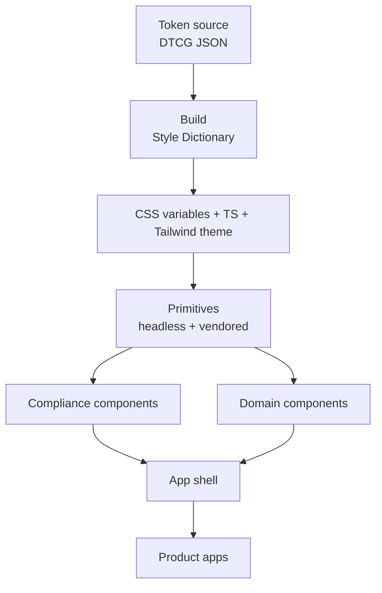
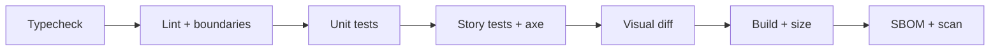
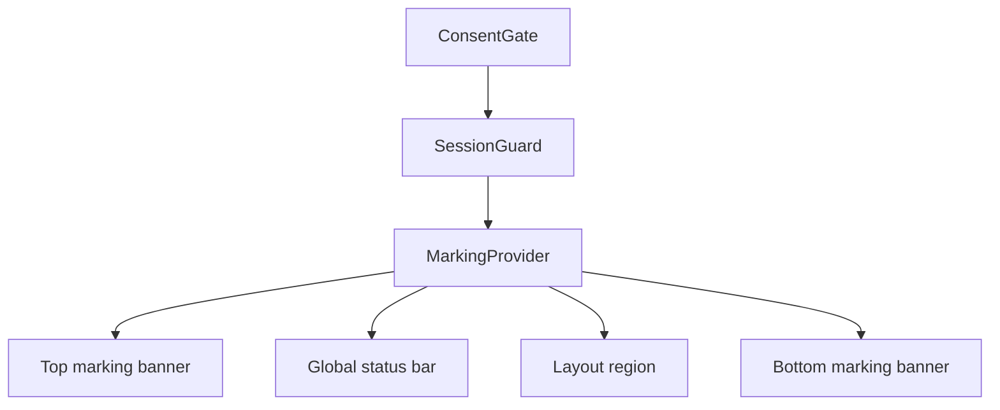
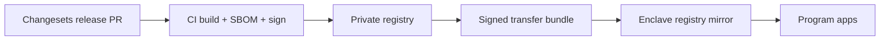

# Mission UI Design System: Build Plan

Sep 24, 2026 · @James Earthman

## Overview

Build the system bottom-up in 13 steps: tokens, then styling, primitives, quality gates, compliance, domain components, shell, docs, conformance, security, and release. You own the tokens and the domain layer. Behavior, accessibility, and heavy rendering are borrowed from vetted libraries.



Each layer depends only on the layers above it. A product app never reaches past the shell into raw tokens or primitives without a reason recorded in an ADR.

### Guiding principles

- **Own the look and the domain, borrow the behavior.** Tokens and mission components are company IP. Focus management, ARIA, and virtualization come from libraries.
- **Offline by default.** Every font, icon, tile, and package must build and run with no internet access.
- **Compile-time styling only.** No runtime style injection, so a strict Content Security Policy works without exceptions.
- **Compliance is a component.** Consent, timeout, and markings ship in the kit, not in each app.
- **Machine-readable rules.** Tokens, lint rules, and CLAUDE.md keep Claude Code and new hires on-system.
- **Few, permissive dependencies.** Every package lands in the SBOM and gets scanned.

### Sequencing

| Step | Outcome | Needed by |
| --- | --- | --- |
| 0 Foundations | Monorepo, ADRs, CLAUDE.md, IP records | First commit |
| 1 Tokens | DTCG token source and build outputs | First demo |
| 2 CSS and theming | Themes, layers, fonts, CSP-safe CSS | First demo |
| 3 Primitives | Vendored accessible base components | First demo |
| 4 Quality gates | Storybook, tests, visual and a11y checks | First demo |
| 5 Compliance | Consent, timeout, markings | First demo |
| 6 Data components | Tables, status, notifications, time | Pilot |
| 7 Geospatial | Map shell, offline tiles, symbology | Pilot |
| 8 App shell | Layouts, navigation, shortcuts | Pilot |
| 9 Docs and agents | Docs site, rules, Claude Code skills | Pilot |
| 10 508 conformance | Tested ACR | Pilot contract |
| 11 Security | SBOM, CSP, offline build, hardened image | ATO work |
| 12 Release and governance | Versioning, registry, contribution model | Second program |

### Working with Claude Code

1. Do one step per branch. Start in plan mode and paste the step's definition of done as acceptance criteria.
2. Ask for an ADR whenever a step contains a decision, before any code is written.
3. At the end of each step, add the new rules to CLAUDE.md so later steps inherit them.
4. Run the tests and open Storybook yourself before merging. Treat the agent's summary as a claim to verify.

## Step 0: Repo foundations

Set up one monorepo where tokens, components, and docs version together, and start the IP paper trail on the first commit.

### Build

1. **Workspace.** pnpm workspaces plus Turborepo. Suggested packages:
   - `packages/tokens`: DTCG source and generated outputs
   - `packages/ui`: primitives and compliance components
   - `packages/mission`: domain components (tables, status, time, entities)
   - `packages/map`: map shell, layers, symbology
   - `apps/docs`: Storybook and guidelines
   - `apps/reference`: a sample app built only from the kit
   - `tooling/*`: shared tsconfig, ESLint, Stylelint configs
2. **TypeScript.** `strict`, `noUncheckedIndexedAccess`, and `exactOptionalPropertyTypes` on from day one. Retrofitting them later is painful.
3. **Node.** Pin an LTS release with `.nvmrc` and `engines`. Style Dictionary v5 requires Node 22 or newer ([migration guide](https://styledictionary.com/versions/v5/migration/)).
4. **Decision records.** `docs/adr/` using the MADR template. Write ADR-0001 for the monorepo layout and ADR-0002 for the primitive library (Step 3).
5. **Commit and release hygiene.** Conventional Commits plus Changesets, so versioning in Step 12 is already wired.
6. **CLAUDE.md.** Start it now with the package map, commands, and a rule that every new component needs a story, a test, and token-only styling.

### Protect the IP

The design system is reusable across programs only if you keep rights to it. Under DFARS 252.227-7014, the government gets restricted rights in noncommercial software developed exclusively at private expense, while title stays with you ([Acquisition.GOV](https://www.acquisition.gov/dfars/252.227-7014-rights-other-commercial-computer-software-and-other-commercial-computer-software-documentation.), [practitioner overview](https://www.governmentcontractslaw.com/2017/08/restricted-rights-dfars-252-227-7014-practitioner-advice-avoiding-dod-licensing-pitfalls/)). Mixed funding generally yields government purpose rights, and exclusively government funding yields unlimited rights ([CMU summary](https://www.cmu.edu/osp/contracts/contracts-process/rights.html)).

- Keep the kit in its own packages so its funding source can be determined separately from contract work.
- Record which work was funded by the company versus a contract: dated commits, timesheets, and charge codes.
- SBIR and STTR awards use a different clause, DFARS 252.227-7018, with its own data-rights category ([Acquisition.GOV](https://www.acquisition.gov/dfars/252.227-7018-rights-other-commercial-technical-data-and-computer-software%E2%80%94small-business-innovation-research-program-and-small-business-technology-transfer-program.)).
- This is not legal advice. Have a govcon attorney review your setup before the first deliverable.

### Standards and references

| Reference | Use it for |
| --- | --- |
| [pnpm workspaces](https://pnpm.io/workspaces) | Package linking and strict dependency isolation |
| [Turborepo](https://turborepo.com/docs) | Task graph and build caching |
| [TypeScript strict](https://www.typescriptlang.org/tsconfig/#strict) | Compiler baseline |
| [MADR](https://adr.github.io/madr/) | ADR template |
| [Conventional Commits 1.0](https://www.conventionalcommits.org/en/v1.0.0/) | Commit format that drives changelogs |
| [Changesets](https://github.com/changesets/changesets) | Per-package versioning |
| [DFARS 227.72](https://www.acq.osd.mil/dpap/dars/dfars/html/current/227_72.htm) | Software rights policy |

### Claude Code prompt

> Scaffold a pnpm + Turborepo monorepo with the packages listed in Step 0 of the plan. Use strict TypeScript with noUncheckedIndexedAccess and exactOptionalPropertyTypes. Add MADR-format ADR-0001 describing the layout. Add Changesets and a commitlint config for Conventional Commits. Create CLAUDE.md with the package map and commands. Do not add any UI dependencies yet.

### Definition of done

- [ ] `pnpm build`, `pnpm lint`, and `pnpm typecheck` pass from a clean clone
- [ ] ADR-0001 merged
- [ ] CLAUDE.md lists packages, commands, and the story/test/token rule
- [ ] Funding-source record started for the kit

## Step 1: Token library

Author every design decision once, in DTCG 2025.10 JSON, and build it with Style Dictionary v5 into CSS variables, TypeScript constants, and a Tailwind theme. DTCG reached its first stable version, 2025.10, in October 2025, with Style Dictionary among its reference implementations ([W3C announcement](https://www.w3.org/community/design-tokens/2025/10/28/design-tokens-specification-reaches-first-stable-version/)). Style Dictionary v5 adopted it as the base format and uses the `.tokens.json` extension ([zeroheight migration notes](https://help.zeroheight.com/hc/en-us/articles/48049028236187-Migrating-to-Style-Dictionary-v5-in-tokens-automation)).

### Tiers

| Tier | Example | Referenced by |
| --- | --- | --- |
| Reference | `color.gray.900`, `space.4` | System tokens only |
| System | `color.surface.raised`, `color.text.primary`, `color.status.critical` | Components and apps |
| Component | `table.row.height`, `marking.banner.height` | That component only |

Apps and components never reference the reference tier directly. A lint rule enforces this in Step 4.

### Token sets to create

- **Color.** Neutral and accent ramps authored in OKLCH, then system roles: surface, text, border, interactive, focus. Add categorical and sequential scales for charts and map layers.
- **Status.** Six levels following Astro's color-temperature model: critical, serious, caution, normal, standby, off. Each level gets fill, border, and on-color tokens. Reserve red for urgent states only ([Astro status system](https://www.astrouxds.com/patterns/status-system/)).
- **Classification.** Banner background and text colors per level, in their own namespace. Never reuse them as status colors.
- **Typography.** A sans and a mono family, a type scale, and a `font.numeric` token set to tabular figures for data columns.
- **Space and size.** 4 px base. Control heights and row heights live here so density can swap them.
- **Density.** `comfortable` and `compact` sets that override control height, row height, and padding.
- **Elevation, radius, border width.** Keep the set small; ops UIs lean on borders more than shadows.
- **Motion.** Durations and easings, plus a reduced-motion set that zeroes nonessential motion.
- **Layers.** A z-index scale where `z.marking` sits above dialogs and popovers. Astro requires that nothing occlude the overall marking banner ([classification markings](https://www.astrouxds.com/components/classification-markings/)).
- **Focus.** Ring width, offset, and color, tested at 3:1 against adjacent colors.

### Classification colors

The government does not mandate digital banner colors. Astro's values follow the SF 706–712 labels plus the SF-902 purple for CUI, which users already recognize ([Astro](https://www.astrouxds.com/components/classification-markings/)).

| Level | Background | Text |
| --- | --- | --- |
| UNCLASSIFIED | #007a33 | white |
| CUI | #502b85 | white |
| CONFIDENTIAL | #0033a0 | white |
| SECRET | #c8102e | white |
| TOP SECRET | #ff8c00 | black |
| TOP SECRET//SCI | #fce83a | black |

### Example token file

Example values only. DTCG 2025.10 colors are objects with a color space, components, and an optional hex fallback, which Style Dictionary v5 supports ([releases](https://github.com/amzn/style-dictionary/releases)).

```json
{
  "color": {
    "$type": "color",
    "gray": {
      "900": { "$value": { "colorSpace": "oklch", "components": [0.21, 0.02, 250], "hex": "#161b22" } }
    },
    "surface": {
      "base": { "$value": "{color.gray.900}", "$description": "App background on ops screens" }
    },
    "status": {
      "critical": { "$value": "{color.red.500}", "$description": "Urgent, needs immediate action. Never decorative." }
    }
  }
}
```

Every system token gets a `$description`. Those descriptions are what Claude Code reads when choosing a token.

### Themes and modes

- Ship `dark` (default for ops floors), `light`, and a high-contrast theme, plus the two density sets.
- The DTCG Resolver module defines how to express contexts like light and dark. Confirm Style Dictionary's support level before relying on it; the fallback is one build pass per theme.
- Output selectors: `:root` for defaults, `[data-theme="light"]`, `[data-density="compact"]`.

### Build outputs

1. `tokens.css`: CSS custom properties per theme and density.
2. `tokens.ts`: typed constants. Map and WebGL layers (Step 7) cannot read CSS variables, so they consume these.
3. `theme.css`: a Tailwind v4 `@theme` block mapping system tokens to utilities (Step 2).
4. `tokens.json`: resolved values for docs and for Figma sync if you add a designer later.

### Tests in the token package

- Every text/surface pair meets 4.5:1 and every non-text UI pair meets 3:1, per WCAG 2.2 SC 1.4.3 and 1.4.11.
- Status fills on light surfaces get a darker border, as Astro specifies, because the fills alone fail AA there.
- No broken aliases, no reference-tier token used outside system tokens, no system token without `$description`.

### Standards and references

| Reference | Use it for |
| --- | --- |
| [DTCG Format 2025.10](https://www.designtokens.org/TR/2025.10/format/) | Token file format |
| [DTCG Resolver 2025.10](https://www.designtokens.org/TR/2025.10/resolver/) | Themes and modes |
| [Style Dictionary v5 migration](https://styledictionary.com/versions/v5/migration/) | Build tool and Node requirement |
| [Astro status system](https://www.astrouxds.com/patterns/status-system/) | Severity model and rules of thumb |
| [Astro classification markings](https://www.astrouxds.com/components/classification-markings/) | Marking colors and placement |
| [WCAG 2.2](https://www.w3.org/TR/WCAG22/) | SC 1.4.1, 1.4.3, 1.4.11 contrast and color use |
| [MIL-STD-1472H via Astro](https://www.astrouxds.com/compliance/mil-std-1472/) | Human-engineering requirements |
| [Naming Tokens in Design Systems](https://medium.com/eightshapes-llc/naming-tokens-in-design-systems-9e86c7444676) | Naming structure |
| [Tailwind theme variables](https://tailwindcss.com/docs/theme) | Mapping tokens to utilities |

### Claude Code prompt

> In packages/tokens, create DTCG 2025.10 token files (.tokens.json) for the tiers and sets in Step 1. Author colors in OKLCH with hex fallbacks. Configure Style Dictionary v5 to emit tokens.css (dark default, light, high-contrast; comfortable and compact density), tokens.ts, and a Tailwind v4 @theme file. Add Vitest tests for WCAG contrast pairs, broken aliases, tier violations, and missing descriptions. Write ADR-0003 explaining the tier model and theme strategy.

### Definition of done

- [ ] `pnpm --filter tokens build` emits all four outputs
- [ ] Contrast, alias, tier, and description tests pass for every theme
- [ ] Classification and status tokens live in separate namespaces
- [ ] ADR-0003 merged; CLAUDE.md says components use system tokens only

## Step 2: CSS architecture and theming

All styling is compile-time: Tailwind v4 utilities over token-backed CSS variables, ordered by cascade layers, with themes switched by data attributes. Tailwind v4 is configured in CSS with `@theme`, and the current line is v4.3 ([Tailwind blog](https://tailwindcss.com/blog)).

### Build

1. **Layer order.** Declare `@layer reset, tokens, base, components, utilities, overrides;` once, at the top of the kit stylesheet. Tailwind v4 relies on native layers, so import order decides precedence.
2. **Tailwind wired to tokens only.** Map system tokens with `@theme inline` so utilities read the CSS variables and follow theme changes at runtime. Reset the default namespaces (for example `--color-*: initial`) so `bg-blue-500` does not exist. Agents and new hires then cannot reach for off-system colors.
3. **Theme switching.** Set `data-theme` and `data-density` on `<html>`. Render them server-side from a preference cookie, or set them from an external script file. Avoid an inline script, which would need a CSP nonce or hash.
4. **CSP-safe styling.** No runtime CSS-in-JS and no inline `<style>` tags, so `style-src 'self'` works. Positioning libraries that write `element.style` through the CSSOM are not blocked by CSP. Server-rendered `style=""` attributes are, so keep them out of SSR output.
5. **User preferences.**
   - `prefers-reduced-motion`: swap to the reduced motion tokens.
   - `prefers-contrast: more`: switch to the high-contrast theme.
   - `forced-colors: active`: Windows contrast themes are common on government machines. They strip backgrounds, so every control needs a real border and focus must use system colors.
   - `prefers-color-scheme`: honor it only when no saved preference exists; ops screens default to dark.
6. **Fonts.** Self-host WOFF2 files through Fontsource packages. Pick OFL-licensed families such as Inter or IBM Plex Sans with IBM Plex Mono or JetBrains Mono. Subset to the scripts you need and use `font-display: swap`. No Google Fonts CDN.
7. **Icons.** Bundle SVG icons from a permissively licensed set, such as Lucide (ISC), as components or a sprite. No icon CDN.
8. **Units and zoom.** `rem` for type and spacing, `px` for hairlines. Test at 200% zoom (SC 1.4.4) and with text-spacing overrides (SC 1.4.12). Reflow (SC 1.4.10) exempts content that needs two-dimensional layout, such as data tables and maps, but the chrome around them must still reflow.
9. **Lint.** Stylelint bans raw color literals outside `packages/tokens`, `!important`, and unlayered rules. A Tailwind lint rule flags arbitrary values like `bg-[#fff]`.

### Standards and references

| Reference | Use it for |
| --- | --- |
| [Tailwind theme variables](https://tailwindcss.com/docs/theme) | `@theme`, namespaces, resets |
| [MDN @layer](https://developer.mozilla.org/en-US/docs/Web/CSS/@layer) | Cascade layer ordering |
| [CSP Level 3](https://www.w3.org/TR/CSP3/) | `style-src` and `script-src` rules |
| [OWASP CSP Cheat Sheet](https://cheatsheetseries.owasp.org/cheatsheets/Content_Security_Policy_Cheat_Sheet.html) | Strict policy patterns |
| [MDN forced-colors](https://developer.mozilla.org/en-US/docs/Web/CSS/@media/forced-colors) | Windows contrast themes |
| [WCAG 2.2](https://www.w3.org/TR/WCAG22/) | SC 1.4.4, 1.4.10, 1.4.12, 2.3.3 |
| [Fontsource](https://fontsource.org/) | Self-hosted font packages |
| [SIL Open Font License](https://openfontlicense.org/) | Font license review |

### Claude Code prompt

> Create the kit stylesheet in packages/ui with the layer order from Step 2. Import the Tailwind v4 theme generated in Step 1 using @theme inline, and reset default color, spacing, and font namespaces so only our tokens exist. Add theme and density switching via data attributes on html with no inline scripts. Add forced-colors, prefers-contrast, and prefers-reduced-motion handling. Self-host fonts with Fontsource. Add Stylelint rules banning color literals, !important, and unlayered CSS. Add a CSP test page served with style-src 'self' and script-src 'self' that must render with zero console violations.

### Definition of done

- [ ] Only token-backed utilities exist; `bg-blue-500` fails the build
- [ ] Theme and density switch without reload in the reference app
- [ ] CSP test page shows zero violations
- [ ] Windows forced-colors check passes on every existing surface
- [ ] No network requests to any external host at runtime

## Step 3: Primitive components

Use one headless library for behavior and accessibility, vendor the styled wrappers into `packages/ui`, and own that code outright. My recommendation for this domain is React Aria Components; Base UI with shadcn/ui is the strong alternative.

### Choose the primitive layer (ADR-0002)

| Option | Strengths | Trade-offs |
| --- | --- | --- |
| [React Aria Components](https://react-aria.adobe.com/) (Adobe, Apache-2.0) | Deepest coverage of hard widgets: time-zone-aware date and time fields, Table with expandable rows, Tree, Virtualizer, drag and drop. Ships Agent Skills for coding agents. | Smaller styled ecosystem; you write more wrappers yourself |
| [Base UI](https://base-ui.com/) + [shadcn/ui](https://ui.shadcn.com/) | Stable 1.x line with frequent releases; shadcn made it the default for new projects in July 2026. Agents know shadcn patterns well. | Weaker on complex data widgets; you will still need specialist libraries for grids and dates |
| Radix + shadcn/ui | Proven and still supported | Community sees slowing development since the WorkOS acquisition; a poor bet for a new product |

Why React Aria here: ops UIs live or die on date and time handling, dense tables, trees, and keyboard operation, which are exactly its strongest areas. Recent releases added expandable Table rows and window scrolling in Virtualizer ([v1.17](https://react-aria.adobe.com/releases/v1-17-0)), and a NavigationTree for app sidebars ([v1.21](https://react-aria.adobe.com/releases/v1-21-0)). Base UI reached a stable 1.0 in December 2025 and shadcn now defaults to it ([shadcn changelog](https://ui.shadcn.com/docs/changelog/2026-07-base-ui-default), [overview](https://blog.openreplay.com/shadcn-ui-radix-base-ui-switch/)). Pick one; mixing two headless libraries doubles your dependency and behavior surface.

### Build

1. **Vendor, don't wrap a package.** Primitives live as source in `packages/ui/src/primitives`. You can patch behavior, review every line for accreditation, and never wait on upstream.
2. **Styling API.** `tailwind-variants` (or `cva`) for variants, `tailwind-merge` for `className` overrides, and state styling through the library's `data-*` attributes.
3. **Component contract.** Every primitive:
   - Supports controlled and uncontrolled use
   - Accepts `ref` as a prop (React 19) and spreads remaining DOM props
   - Uses only system tokens
   - Names its parts after the matching WAI-ARIA APG pattern
4. **Density.** Size comes from density tokens, not per-component `size` props, so one attribute on `<html>` retunes the whole app. Keep `size` only where a local exception is real, such as an icon button in a toolbar.
5. **First inventory.** Button, IconButton, ToggleButton, Link, TextField, NumberField, SearchField, Select, ComboBox, Checkbox, RadioGroup, Switch, Slider, Tabs, Dialog, AlertDialog, Popover, Tooltip, Menu, Disclosure, TagGroup, Toast, DateField, TimeField, DatePicker, Breadcrumbs, ProgressBar, Meter.
6. **Forms.** Pair with TanStack Form or React Hook Form plus Zod. Validation messages follow one pattern kit-wide.

### Standards and references

| Reference | Use it for |
| --- | --- |
| [WAI-ARIA Authoring Practices](https://www.w3.org/WAI/ARIA/apg/) | Keyboard and ARIA behavior per pattern |
| [React Aria](https://react-aria.adobe.com/) | Primitive library and its Agent Skills |
| [Base UI](https://base-ui.com/) | Alternative primitive library |
| [shadcn/ui registry](https://ui.shadcn.com/docs/registry) | Vendoring model for your own components |
| [Open UI](https://open-ui.org/) | Cross-library component naming research |
| [Astro component guidance](https://www.astrouxds.com/components/getting-started/) | Ops-specific usage rules per component |

### Claude Code prompt

> Write ADR-0002 comparing React Aria Components and Base UI for our primitive layer using the criteria in Step 3; recommend React Aria. After I approve it, vendor styled primitives into packages/ui/src/primitives for the Step 3 inventory, starting with Button, TextField, Select, Dialog, and Menu. Use tailwind-variants and tailwind-merge, system tokens only, data attributes for state, and React 19 ref-as-prop. Each component gets a story and an interaction test covering its WAI-ARIA APG keyboard behavior.

### Definition of done

- [ ] ADR-0002 merged
- [ ] Full first inventory vendored, each with a story and keyboard test
- [ ] Switching density on `<html>` changes every control height
- [ ] No primitive imports a color or size outside system tokens

## Step 4: Quality gates

Every component passes the same automated gates in CI: stories run as tests, axe-core checks accessibility, screenshots catch visual drift, and lint rules keep code on-system. Set these up now, before the component count grows, because Claude Code will lean on them as its feedback loop.

### Build

1. **Stories as tests.** Storybook 10 with the Vitest addon, which runs stories as component tests in Vitest browser mode driven by Playwright, with coverage built in ([migration guide](https://storybook.js.org/docs/writing-tests/integrations/vitest-addon/migration-guide.md)). The current addon line is 10.6 ([npm](https://www.npmjs.com/package/@storybook/addon-vitest)).
2. **Accessibility checks.** The a11y addon runs axe-core on every story. Set `parameters.a11y.test` to `'error'` so violations fail CI rather than just showing in a panel.
3. **Theme and density matrix.** Global toolbar controls for theme and density. Critical stories run in all three themes and both densities.
4. **Keyboard tests.** A `play` function per primitive that walks its WAI-ARIA APG keyboard behavior: Tab order, arrow keys, Escape, Home and End.
5. **Visual regression.** Playwright `toHaveScreenshot` in a pinned browser container, so nothing leaves your CI environment. Chromatic is faster to set up if your security policy allows a SaaS service to see the kit.
6. **Page-level checks.** Playwright plus `@axe-core/playwright` on the reference app for landmarks, heading order, and focus restoration after dialogs.
7. **Lint and boundaries.**
   - `eslint-plugin-jsx-a11y` for markup mistakes
   - A custom rule banning reference-tier token imports and raw colors
   - dependency-cruiser enforcing layer direction: `mission` may import `ui`, never the reverse
8. **Budgets.** `size-limit` per package, so a stray dependency shows up in review.
9. **Agent loop.** Add Claude Code hooks that run typecheck and lint after each edit, so the agent sees failures immediately instead of at PR time.

Automated checks catch only part of WCAG. Manual screen reader and keyboard testing in Step 10 is still required.

### CI order



The SBOM and scan stage is defined in Step 11; leave a placeholder job now.

### Standards and references

| Reference | Use it for |
| --- | --- |
| [Storybook Vitest addon](https://storybook.js.org/docs/writing-tests/integrations/vitest-addon) | Stories as tests |
| [Storybook accessibility testing](https://storybook.js.org/docs/writing-tests/accessibility-testing) | axe-core in stories |
| [axe-core](https://github.com/dequelabs/axe-core) | Rule engine and WCAG tags |
| [Playwright visual comparisons](https://playwright.dev/docs/test-snapshots) | Self-hosted screenshot diffs |
| [Playwright accessibility testing](https://playwright.dev/docs/accessibility-testing) | Page-level axe scans |
| [Testing Library guiding principles](https://testing-library.com/docs/guiding-principles) | Query by role, test like a user |
| [eslint-plugin-jsx-a11y](https://github.com/jsx-eslint/eslint-plugin-jsx-a11y) | Static a11y lint |
| [dependency-cruiser](https://github.com/sverweij/dependency-cruiser) | Layer boundaries |
| [size-limit](https://github.com/ai/size-limit) | Bundle budgets |

### Claude Code prompt

> Set up Storybook 10 in apps/docs with the Vitest and a11y addons. Fail on any axe violation. Add global theme and density toolbars and a test matrix for stories tagged critical. Add Playwright screenshot tests in a pinned Docker image. Add eslint-plugin-jsx-a11y, a custom ESLint rule banning reference-tier tokens and raw colors, dependency-cruiser layer rules, and size-limit. Wire the CI order from Step 4. Add Claude Code hooks that run typecheck and lint after file edits.

### Definition of done

- [ ] CI runs every stage in order and blocks merge on failure
- [ ] Deliberately introduced contrast and keyboard bugs both fail CI
- [ ] Screenshot baselines exist for all themes and densities
- [ ] Hooks run on every Claude Code edit

## Step 5: Compliance components

Ship three components that every DoW app needs before anyone logs in or sees data: a consent gate, a session guard, and classification markings. Building them once in the kit means each app inherits them and assessors review one implementation.

### Consent gate

- The Application Security and Development STIG requires the Standard Mandatory DoD Notice and Consent Banner before granting access ([V-222434](https://www.stigviewer.com/stigs/application_security_and_development/2025-02-12/finding/V-222434)). It must stay on screen until the user explicitly acknowledges it ([V-222435](https://stigviewer.com/stigs/application_security_and_development/2025-02-12/finding/V-222435)).
- The text comes from the DoD CIO memo of May 9, 2008, which offers a long and a short version and permits no deviations without written authorization ([memo](https://dodcio.defense.gov/Portals/0/Documents/DoDBanner-9May2008-ocr.pdf)). Store it as a constant copied verbatim, with a test that fails if it changes.
- Implementation: a full-screen gate before sign-in. It cannot be dismissed with Escape or an outside click, needs one explicit acknowledge action, and records the acknowledgment server-side.
- Maps to NIST SP 800-53 AC-8, System Use Notification.

### Session guard

- The STIG sets a 15-minute idle limit for non-privileged users ([V-222389](https://www.stigqter.com/stigs/SV-222389r508029_rule.html)); a shorter limit applies to privileged users (V-222390, check the current release). Timeout events must be logged ([V-222445](https://www.stigviewer.com/stigs/application_security_and_development/2025-02-12/finding/V-222445)).
- WCAG 2.2 SC 2.2.1 requires warning users before a time limit expires and letting them extend it with a simple action, with at least 20 seconds to respond.
- Implementation:
  1. Track activity (pointer, keyboard) and share it across tabs with `BroadcastChannel`, so one active tab keeps the session alive.
  2. Show an AlertDialog with a live countdown about 2 minutes before expiry, with a single Extend action.
  3. On expiry, clear client state and caches, then return to the consent gate.
  4. The server enforces the real timeout. The client timer is a UX layer, never the control itself.
- Idle and absolute timeouts come from config, since programs set their own values.
- Maps to NIST SP 800-53 AC-11 (device lock) and AC-12 (session termination).

### Classification markings

Follow Astro's marking guidance, which points to ISOO and NARA as the controlling authorities ([Astro](https://www.astrouxds.com/components/classification-markings/)).

- **Overall marking banner.** Fixed at the top of the viewport and never occluded; a matching bottom banner is best practice. Bold, centered, all capitals. Spell out the level (UNCLASSIFIED, not U), except CUI. Since December 2024, CUI banners read just "CUI" with no category in the banner line.
- **Portion markings.** Abbreviated in parentheses, such as (CUI) or (S), at the top or top-left of the portion. Use a tag at section and card level and inline text lower in the hierarchy. A portion may never exceed the overall marking.
- **Authority block.** A Classification Authority Block for classified data and a Designation Indicator for CUI, placed inside the area bracketed by the banners.
- **Architecture.**
  - `MarkingProvider` holds the system-high marking from server config, never from a hard-coded default.
  - `PortionMarking` registers with the provider; a dev-mode assertion fails if any portion exceeds the overall marking.
  - A print stylesheet repeats banners on every printed page, and export utilities stamp the marking into file names and headers.
- **Non-production environments.** A DEV or TEST indicator must look nothing like a classification banner.

### Standards and references

| Reference | Use it for |
| --- | --- |
| [ASD STIG on STIG Viewer](https://www.stigviewer.com/stigs/application_security_and_development) | Consent, timeout, and logging checks |
| [DoD Notice and Consent Banner memo](https://dodcio.defense.gov/Portals/0/Documents/DoDBanner-9May2008-ocr.pdf) | Mandatory banner text |
| [NIST SP 800-53 Rev. 5](https://csrc.nist.gov/pubs/sp/800/53/r5/upd1/final) | AC-8, AC-11, AC-12 |
| [WCAG 2.2 SC 2.2.1](https://www.w3.org/WAI/WCAG22/Understanding/timing-adjustable.html) | Timeout warning and extension |
| [Astro classification markings](https://www.astrouxds.com/components/classification-markings/) | Banner, portion, authority block patterns |
| [NARA CUI Registry](https://www.archives.gov/cui) | CUI categories and marking rules |
| [DoD CUI Program](https://www.dodcui.mil/) | DoD-specific CUI guidance |
| [ISOO marking booklet](https://www.archives.gov/files/isoo/notices/marking-booklet-revision.pdf) | Classified marking rules |

### Claude Code prompt

> In packages/ui/src/compliance, build ConsentGate, SessionGuard, MarkingProvider, OverallMarkingBanner, PortionMarking, and AuthorityBlock per Step 5. The consent text is a verbatim constant I will paste in; add a test that snapshots it. SessionGuard shares activity across tabs with BroadcastChannel, warns with an AlertDialog and live countdown, and takes idle and absolute timeouts from config. MarkingProvider reads system-high from props, asserts no portion exceeds it in dev, and supplies a print stylesheet. Banners use z.marking and are never occluded. Write stories and tests for each, including a test that a dialog cannot cover the banner.

### Definition of done

- [ ] Consent gate blocks the app until acknowledged; Escape and outside clicks do nothing
- [ ] Session guard warns, extends, expires, and syncs across two tabs in a Playwright test
- [ ] Banners stay visible above every overlay and on print
- [ ] Dev assertion fires when a portion exceeds the overall marking
- [ ] Control mapping (AC-8, AC-11, AC-12) recorded in the docs for your security package

## Step 6: Data domain components

These components are the real design system and your differentiator: the table, status, notifications, time, and entity views that operators stare at all shift. They live in `packages/mission` and build only on Step 3 primitives and Step 1 tokens.

### Components

| Component | Core requirements | Build on |
| --- | --- | --- |
| DataTable | Virtualized 100k+ rows, sticky header, column resize/pin/reorder, multi-sort, APG grid keyboard model, live updates that keep scroll, selection, and focus | TanStack Table + TanStack Virtual, or React Aria Table + Virtualizer |
| StatusSymbol / StatusChip | Shape plus color for all six levels; roll-up shows the most urgent child | Astro status system |
| Notifications | App banner, toast, and a persistent log with acknowledge, filter, and grouping | Astro notifications pattern |
| Clock | UTC (Zulu) and local side by side; DTG display format | `@internationalized/date` |
| TimeRangePicker / Timeline | Time-zone-aware inputs, playback scrubber for replaying tracks | React Aria date/time fields |
| EntityCard / EntityPanel | ID, type, status, last update, position, portion marking, stale-data indicator | Primitives + Step 5 markings |
| EventLog | Append-only, timestamped, filterable feed | Astro Log component |
| Charts | Token-driven series colors, large-data rendering | Apache ECharts (Apache-2.0) |

### Rules that apply to every data component

1. **Stale and disconnected states.** Every component shows data age and degrades visibly when data goes stale. Assume DDIL networks (denied, disrupted, intermittent, limited) and design the disconnected state first.
2. **Time.** Store and transmit ISO 8601 UTC. Display Zulu by default, with the date-time group format (`DDHHMMZ MON YY`) available where operators expect it. Relative time ("3 min ago") always has the absolute time in a tooltip.
3. **Live-region discipline.** `role="status"` for routine updates and `role="alert"` only for critical ones. A table ticking every second must not flood a screen reader; announce summaries, not cell changes.
4. **Alert fatigue.** Rate-limit, group duplicates, and require acknowledgment only for critical alerts. Astro's research found that overusing red strips it of meaning ([status system](https://www.astrouxds.com/patterns/status-system/)).
5. **Markings in data.** Where rows differ in classification, add a labeled marking column instead of parentheses in each cell, as Astro recommends ([markings](https://www.astrouxds.com/components/classification-markings/)).
6. **Numbers.** Tabular figures, right-aligned, fixed precision per column, units in the header.
7. **Build or buy the grid.** Start with TanStack Table. If you need pivoting, server-side row models, and grouping at scale, AG Grid Enterprise is the buy option; confirm its license terms cover on-prem and classified deployment.

### Standards and references

| Reference | Use it for |
| --- | --- |
| [APG grid pattern](https://www.w3.org/WAI/ARIA/apg/patterns/grid/) | Table keyboard model |
| [TanStack Table](https://tanstack.com/table) / [TanStack Virtual](https://tanstack.com/virtual) | Headless table and virtualization |
| [Astro table pattern](https://www.astrouxds.com/patterns/table/) | Ops table conventions |
| [Astro notifications](https://www.astrouxds.com/patterns/notifications/) | Banner, toast, and log usage |
| [Astro clock](https://www.astrouxds.com/components/clock/) / [log](https://www.astrouxds.com/components/log/) | Time and event feed patterns |
| [Astro data visualization](https://www.astrouxds.com/patterns/data-visualization/) | Chart guidance |
| [@internationalized/date](https://react-spectrum.adobe.com/internationalized/date/) | Time-zone-aware date math |
| [ISO 8601](https://www.iso.org/iso-8601-date-and-time-format.html) | Timestamp format |
| [Apache ECharts](https://echarts.apache.org/) | Large-data charts |
| [AG Grid licensing](https://www.ag-grid.com/license-pricing/) | Buy-option license terms |

### Claude Code prompt

> In packages/mission, build DataTable on TanStack Table and TanStack Virtual with the APG grid keyboard model, sticky header, column resize/pin/reorder, multi-sort, and a marking column option. Live updates must preserve scroll, selection, and focus. Add a benchmark story with 100,000 rows updating 10 rows per second. Then build StatusSymbol, Clock (UTC plus local, DTG format), EntityCard with a stale-data indicator, and a notification system with banner, toast, and acknowledged log. Every component has stale, disconnected, empty, loading, and error states in Storybook.

### Definition of done

- [ ] 100k-row benchmark scrolls smoothly with live updates on a mid-range laptop
- [ ] Keyboard-only user can sort, select, and open an entity from the table
- [ ] Screen reader hears summaries, not per-cell churn, during live updates
- [ ] Every component has stale and disconnected stories
- [ ] All timestamps display Zulu by default

## Step 7: Geospatial and symbology

One `packages/map` wraps MapLibre GL JS for the basemap and deck.gl for high-volume data layers, runs fully offline from PMTiles, and renders MIL-STD-2525E symbology with milsymbol. Put the engine behind an adapter so a customer who mandates ArcGIS does not force a rewrite.

### Build

1. **Engine and adapter.** MapLibre GL JS with deck.gl interleaved for tracks, heatmaps, and anything above a few thousand features. Define a `MapAdapter` interface (camera, layers, selection, events) that the rest of the kit uses. An ArcGIS Maps SDK adapter can then implement it later if a program requires it.
2. **Offline basemaps.** Serve PMTiles archives from your own static host. PMTiles is a single file on static storage, works offline, and suits air-gapped deployments ([MapLibre agent skills](https://github.com/maplibre/maplibre-agent-skills/blob/main/skills/maplibre-tile-sources/AGENTS.md)). MapLibre fetches glyphs and sprites separately, so bundle them locally and point `style.json` at relative paths ([maplibre-offline-pmtiles notes](https://github.com/makinacorpus/maplibre-offline-pmtiles)). Customer imagery arrives through WMTS or raster PMTiles.
3. **Styles from tokens.** Generate MapLibre style colors from `tokens.ts` per theme. The dark basemap is the default. Theme changes update paint properties rather than reloading the map.
4. **Symbology.** milsymbol 3.x renders as closely as possible to MIL-STD-2525E and APP-6 E, as SVG or canvas ([npm](https://www.npmjs.com/package/milsymbol)). Its 2525E color mode adds a suspect color ([changelog](https://github.com/spatialillusions/milsymbol/blob/master/CHANGELOG.md)).
   - Store every track with its 20-digit SIDC as canonical identity and keep 2525 versus APP-6 frame style as a display preference ([overview](https://corvusintell.com/blog/c2-systems/app6-vs-mil-std-2525-symbology/)).
   - Rasterize symbols into a texture atlas for deck.gl `IconLayer`; do not mount thousands of SVGs in the DOM.
   - Affiliation colors (friend, hostile, neutral, unknown, suspect) get a third token namespace, separate from status and classification.
5. **Coordinates.** WGS 84. Readouts in MGRS, decimal degrees, and DMS, with a per-user preference. Inputs accept all three and normalize. Use the `mgrs` library; MGRS itself is defined by NGA standard NGA.STND.0037.
6. **Layer panel.** A tree with visibility, opacity, order, legend, data age, and a portion marking per layer. Build it on the React Aria Tree.
7. **Map accessibility.** Keyboard pan and zoom, and a synchronized feature list (the Step 6 DataTable) as the text alternative for SC 1.1.1. Selecting in either view selects in both and is announced.
8. **Data services.** Consume OGC API Features and Tiles, WMS, and WMTS so customer GEOINT services plug in without custom code.

### Standards and references

| Reference | Use it for |
| --- | --- |
| [MapLibre GL JS](https://maplibre.org/maplibre-gl-js/docs/) | Basemap engine |
| [MapLibre style spec](https://maplibre.org/maplibre-style-spec/) | Token-driven styles |
| [MapLibre agent skills](https://github.com/maplibre/maplibre-agent-skills) | Claude Code skills for map code |
| [PMTiles](https://github.com/protomaps/PMTiles) / [Protomaps docs](https://docs.protomaps.com/) | Offline tile archives and basemap builds |
| [deck.gl](https://deck.gl/) | High-volume GPU layers |
| [milsymbol](https://github.com/spatialillusions/milsymbol) | MIL-STD-2525 and APP-6 rendering |
| [mgrs](https://github.com/proj4js/mgrs) | MGRS conversion |
| [OGC API](https://ogcapi.ogc.org/) | Features and Tiles service standards |

### Claude Code prompt

> Install the MapLibre agent skills into .claude/skills. In packages/map, define a MapAdapter interface and a MapLibre implementation with deck.gl interleaved. Load a PMTiles basemap with local glyphs and sprites; the map must render with the network disabled. Generate style colors from tokens.ts for each theme. Add a track layer that renders milsymbol symbols from 20-digit SIDCs via a texture atlas in an IconLayer, with 2525/APP-6 frame preference. Add a coordinate readout and input supporting MGRS, DD, and DMS. Add a layer panel on React Aria Tree. Sync selection with a DataTable feature list. Benchmark 10,000 moving tracks.

### Definition of done

- [ ] Map renders with all external hosts blocked
- [ ] 10,000 tracks update at 1 Hz without dropped frames on a mid-range laptop
- [ ] Keyboard user can pan, zoom, and select a track via the synced list
- [ ] Affiliation, status, and classification colors never share tokens
- [ ] Coordinate input round-trips MGRS, DD, and DMS

## Step 8: App shell and layout patterns

The shell composes the compliance components, a global status bar, and a small set of layouts so every product app starts identical and operator-ready. Build it in `packages/ui/src/shell` and prove it in `apps/reference`.

### Shell structure



The global status bar follows Astro's pattern: app name, connection state, UTC clock, notifications, and the user menu ([Astro global status bar](https://www.astrouxds.com/components/global-status-bar/)). Connection state is first-class because DDIL links drop without warning.

### Layouts to ship

| Layout | Use it for |
| --- | --- |
| Map + panes | Common operational picture with side and bottom modeless panes |
| Master-detail | Entity list with a detail panel |
| Full table | Analyst views dominated by one grid |
| Dashboard grid | Status overviews with cards and charts |

### Build

1. **Resizable, persistent panes.** `react-resizable-panels` for splits. Persist layouts per user so an operator's arrangement survives reloads. Follow Astro's modeless panes guidance so panes never block the map.
2. **URL state.** View state (selected entity, time range, filters, layers) lives in typed search params via TanStack Router, so a link reproduces what a teammate sees.
3. **Multi-monitor.** Ops floors run several displays. Support popping a pane into its own window with `window.open`, synced over `BroadcastChannel`. The Window Management API can place windows on specific screens in Chromium browsers.
4. **Keyboard.** A command palette plus shortcuts, registered through one registry that shows them in a help dialog. Single-key shortcuts must be remappable or able to be turned off (WCAG SC 2.1.4).
5. **Focus and sticky chrome.** Set `scroll-padding-top` and `scroll-padding-bottom` to the banner and status bar heights so focused elements are never hidden under them (SC 2.4.11). Add skip links to each major region (SC 2.4.1).
6. **Target size.** Compact density still keeps targets at least 24 by 24 CSS pixels or spaced to match (SC 2.5.8).
7. **Screens and browsers.** Design at 1920×1080 and test on 4K and small-laptop resolutions. Test on managed Edge and Chrome, the usual government baseline, not only your dev browser.
8. **Landmarks.** One `main`, labeled `nav` and `complementary` regions, and one `h1` per view.

### Standards and references

| Reference | Use it for |
| --- | --- |
| [Astro global status bar](https://www.astrouxds.com/components/global-status-bar/) | Status bar contents |
| [Astro modeless panes](https://www.astrouxds.com/patterns/modeless-panes/) | Pane behavior |
| [Astro navigation](https://www.astrouxds.com/patterns/navigation/) | App navigation patterns |
| [Astro focus state](https://www.astrouxds.com/patterns/focus/) | Focus visuals on dark UIs |
| [WCAG 2.2](https://www.w3.org/TR/WCAG22/) | SC 2.1.4, 2.4.1, 2.4.11, 2.5.8 |
| [MIL-STD-1472H via Astro](https://www.astrouxds.com/compliance/mil-std-1472/) | Human-engineering layout rules |
| [react-resizable-panels](https://github.com/bvaughn/react-resizable-panels) | Split panes |
| [TanStack Router search params](https://tanstack.com/router/latest/docs/framework/react/guide/search-params) | Typed URL state |
| [MDN Window Management API](https://developer.mozilla.org/en-US/docs/Web/API/Window_Management_API) | Multi-screen placement |

### Claude Code prompt

> In packages/ui/src/shell, compose ConsentGate, SessionGuard, MarkingProvider, top and bottom banners, and a GlobalStatusBar with connection state, UTC clock, notifications, and user menu. Add the four layouts from Step 8 with react-resizable-panels, per-user persisted layouts, and typed URL state via TanStack Router. Add a shortcut registry with a command palette and a help dialog, with single-key shortcuts that can be disabled. Set scroll-padding for sticky chrome and add skip links. Build apps/reference using only the shell and kit components.

### Definition of done

- [ ] Reference app runs each layout with live mock data
- [ ] A copied URL restores selection, time range, filters, and layers
- [ ] A popped-out pane stays in sync with the main window
- [ ] Tabbing never lands on an element hidden under a banner
- [ ] Compact density passes the 24 px target-size check

## Step 9: Documentation and agent enablement

The docs have two readers: people in Storybook and Claude Code in the repo. Both should read the same sources (token descriptions, component usage rules, pattern pages) so guidance never forks. Start this step properly once Step 6 lands, but keep CLAUDE.md current from Step 0 on.

### Human docs

1. **One docs site.** Storybook in `apps/docs`, organized with Diátaxis: tutorials, how-to guides, reference, and explanation.
2. **Foundations pages** render tokens from `tokens.json`, so they can never drift from the code.
3. **Component pages** in MDX follow one template: when to use, when not to, anatomy, keyboard table, accessibility notes, and do and don't examples.
4. **Pattern pages** for compliance, status, time, map, and layouts, each linking the standards in this plan.
5. **Write rules, not prose.** "Use StatusChip for state; never use color alone" is easier for both people and agents to follow than a paragraph.

### Agent enablement

1. **Layered instructions.** Keep the root CLAUDE.md short: package map, commands, and the golden rules. Put package-specific guidance in path-scoped rules under `.claude/rules/`, which Claude Code loads only when working in matching paths ([memory docs](https://code.claude.com/docs/en/memory)). Claude Code also reads AGENTS.md, so one file can serve other tools.
2. **Move procedures into skills.** Claude Code's cost guidance recommends moving instructions out of CLAUDE.md into skills, which load on demand ([costs](https://code.claude.com/docs/en/costs)). Skills to write in `.claude/skills/`:
   - `new-component`: scaffold component, story, keyboard test, docs page, and changeset from the template, using system tokens only
   - `add-token`: add a token with `$description` and run the contrast tests
   - `a11y-review`: walk the WAI-ARIA APG pattern and WCAG checklist, then run axe
   - `compliance-check`: confirm an app uses ConsentGate, SessionGuard, and MarkingProvider correctly
3. **Third-party skills.** Install React Aria's Agent Skills ([v1.15 notes](https://react-aria.adobe.com/releases/v1-15-0)) and the MapLibre agent skills ([repo](https://github.com/maplibre/maplibre-agent-skills)).
4. **Review subagent.** A `design-system-reviewer` subagent checks diffs for off-token styling, accessibility regressions, and layer violations. Claude Code's best practices recommend an adversarial review step like this ([best practices](https://code.claude.com/docs/en/best-practices)).
5. **Component manifest.** Storybook 10.1 added an experimental component manifest for a Storybook MCP server. Evaluate it once your component count makes API lookup a bottleneck.
6. **Hooks** from Step 4 keep the agent's feedback loop tight.
7. **Data handling.** Before pointing any AI tool at contract code or data, confirm your contract and security plan allow it. Keep CUI out of prompts unless you are on an approved deployment path; review Claude Code's data usage and zero data retention options ([data usage](https://code.claude.com/docs/en/data-usage), [ZDR](https://code.claude.com/docs/en/zero-data-retention)).

### Standards and references

| Reference | Use it for |
| --- | --- |
| [Diátaxis](https://diataxis.fr/) | Docs structure |
| [Storybook docs](https://storybook.js.org/docs/writing-docs) | MDX component pages |
| [Claude Code memory and rules](https://code.claude.com/docs/en/memory) | CLAUDE.md, AGENTS.md, path-scoped rules |
| [Claude Code skills](https://code.claude.com/docs/en/skills) | Writing project skills |
| [Claude Code subagents](https://code.claude.com/docs/en/sub-agents) | Review subagent |
| [Claude Code hooks](https://code.claude.com/docs/en/hooks-guide) | Automated checks on edit |
| [Claude Code in large codebases](https://code.claude.com/docs/en/large-codebases) | Monorepo layering |

### Claude Code prompt

> Restructure apps/docs with Diátaxis sections and an MDX template for component pages (when to use, when not, anatomy, keyboard table, a11y notes, do/don't). Generate foundations pages from tokens.json. Split CLAUDE.md into a short root file plus path-scoped rules in .claude/rules for tokens, ui, mission, and map. Create the skills new-component, add-token, a11y-review, and compliance-check in .claude/skills, and a design-system-reviewer subagent that reviews diffs against our rules. Install React Aria and MapLibre agent skills.

### Definition of done

- [ ] Every shipped component has a docs page from the template
- [ ] Root CLAUDE.md is under about 100 lines; package rules live in `.claude/rules/`
- [ ] `new-component` skill produces a passing component end to end
- [ ] Reviewer subagent flags a planted off-token color and a missing label
- [ ] Written decision on AI tool use with contract data, approved by whoever owns your security plan

## Step 10: Accessibility conformance and Section 508

Section 508 legally requires WCAG 2.0 Level AA, but build and test to WCAG 2.2 AA and report conformance with an ACR on the VPAT 2.5 template. Automated checks from Step 4 are necessary but not sufficient; this step adds manual testing with real assistive technology and the report buyers ask for.

### Which standard and template

- The 2017 Section 508 refresh incorporated WCAG 2.0 A and AA and took effect in January 2018 ([Level Access overview](https://www.levelaccess.com/compliance-overview/section-508-compliance/)).
- ITI publishes VPAT 2.5 in four editions: 508, EU, WCAG, and INT ([ITI](https://www.itic.org/policy/accessibility/vpat)). The 508 edition still references WCAG 2.0, while the WCAG and INT editions cover 2.2 ([comparison](https://medium.com/@marketing_58999/vpat-2-5-vs-2-4-what-changed-and-why-it-matters-for-your-next-acr-b4c009bc75a9)).
- Use the 508 edition for DoW buyers. Use INT if you also sell to allies under EN 301 549. Either way, reviewers increasingly ask about WCAG 2.2, so note your 2.2 status in the remarks.
- Section508.gov tells buyers to expect the Revised 508 edition, version 2.x or later ([ACR FAQ](https://www.section508.gov/sell/acr-vpat-faq/)).

### Manual test matrix

| Assistive technology | Browser | What to verify |
| --- | --- | --- |
| JAWS | Chrome or Edge | Common in federal workplaces; table navigation, live regions, dialogs |
| NVDA | Firefox or Chrome | Second screen reader to catch JAWS-specific workarounds |
| Windows Narrator | Edge | Built-in fallback on locked-down machines |
| Keyboard only | Any | Every flow, visible focus, no traps |
| Windows contrast themes | Edge | Borders, focus, status symbols still distinguishable |
| Magnification at 200% and 400% | Any | Chrome reflow, sticky banners, focus not hidden |
| Speech input (Dragon or Voice Access) | Chrome or Edge | Visible labels match accessible names (SC 2.5.3) |

### Build

1. **Critical-flow scripts.** Consent, sign-in, open map, select a track, acknowledge an alert, export. Run each against the matrix before every release.
2. **Test method.** Align with the DHS Trusted Tester process and the ICT Testing Baseline so your results match how agencies test. Consider having one engineer complete Trusted Tester training if eligible.
3. **Two ACRs.** A kit-level ACR covering components, reused across programs, plus a product-level ACR per app. Describe evaluation methods, and write honest "Partially Supports" remarks with workarounds.
4. **Complex visuals.** Document the map's equivalent: the synchronized feature list from Step 7 satisfies the text-alternative need for most tasks.
5. **Cadence.** Re-test and update the ACR each major release, and date every revision.
6. **External audit.** Budget for a third-party audit before the first production contract; buyers trust it more than a self-assessment.

### Standards and references

| Reference | Use it for |
| --- | --- |
| [Revised 508 Standards](https://www.access-board.gov/ict/) | Legal requirements, including Chapters 3 and 5 |
| [WCAG 2.2](https://www.w3.org/TR/WCAG22/) | Build and test target |
| [ITI VPAT 2.5](https://www.itic.org/policy/accessibility/vpat) | ACR templates |
| [Section508.gov ACR FAQ](https://www.section508.gov/sell/acr-vpat-faq/) | What federal buyers expect |
| [DHS Trusted Tester](https://www.dhs.gov/trusted-tester) | Government test process |
| [W3C ACT rules](https://www.w3.org/WAI/standards-guidelines/act/rules/) | Harmonized test rules |

### Claude Code prompt

> Create docs/accessibility with a test plan for the critical flows in Step 10 and the assistive technology matrix as a checklist per release. Generate a VPAT 2.5 Revised 508 edition skeleton for the kit, pre-filled with success criteria and our automated evidence from Storybook and Playwright, leaving remarks for manual results marked TODO. Add an accessibility statement page to apps/reference with a feedback contact.

### Definition of done

- [ ] Every critical flow passes the full matrix
- [ ] Kit ACR and first product ACR published internally, dated, with methods described
- [ ] Known gaps logged as issues with owners
- [ ] External audit scheduled before the first production delivery

## Step 11: Security, supply chain, and disconnected builds

Treat the frontend as part of the ATO package: every dependency inventoried in an SBOM, a strict CSP, zero runtime egress, reproducible offline builds, and a hardened image to serve it. Most of this is cheap if the earlier steps held the line on dependencies and CDNs.

### Keep CUI out of the kit

The DoW suspended CMMC Phase 2 on July 13, 2026, but Phase 1 self-assessments and DFARS 252.204-7012 safeguarding obligations remain in force ([WilmerHale](https://www.wilmerhale.com/en/insights/client-alerts/20260720-pentagon-suspends-cmmc-phase-2-requirements-and-launches-review-of-cybersecurity-certification-program)). Under 7012, systems handling covered defense information implement NIST SP 800-171, and cloud services that touch it must meet FedRAMP Moderate or equivalent ([summary](https://itsecops.cloud/cmmc-phase-2-suspended/)).

The practical rule: the kit repo, Storybook, CI, and visual testing use synthetic data only. Then SaaS tools like hosted CI or Chromatic stay out of your CUI boundary, and the kit can move between programs freely.

### Build

1. **Dependency policy.**
   - License allowlist for shipped code: MIT, Apache-2.0, BSD, ISC, plus OFL for fonts. Anything else needs an ADR.
   - pnpm 10 blocks dependency install scripts unless allowlisted; keep that list short. Set a minimum release age so brand-new package versions wait before they can install.
   - A new runtime dependency requires a PR note on why and what it replaces.
2. **SBOM and scanning.** Generate a CycloneDX SBOM per release for the app bundle and the container image. Scan with OSV-Scanner or Grype and fail CI on high or critical findings without a documented exception. This fills the placeholder job from Step 4.
3. **Signing and provenance.** Sign release artifacts and images with Sigstore cosign and target SLSA build provenance.
4. **Offline builds.** Mirror npm into the enclave (Artifactory, Nexus, or Verdaccio) and install with `pnpm install --offline` from the lockfile. Mirror Playwright browser binaries too. No build step may download fonts, tiles, or anything else. Pin Node and set `SOURCE_DATE_EPOCH` for reproducible output.
5. **Zero runtime egress.** No SaaS analytics, error reporting, or CDNs. Send errors and telemetry to a self-hosted endpoint on the same origin, or not at all.
6. **Strict CSP and headers.** Start from:
   - `default-src 'self'; script-src 'self'; style-src 'self'; img-src 'self' data: blob:; connect-src 'self'; worker-src 'self' blob:; frame-ancestors 'none'; base-uri 'self'; form-action 'self'`
   - MapLibre needs blob workers, or use its CSP build with a separate worker file.
   - Add `require-trusted-types-for 'script'` once the kit passes; Trusted Types are supported in Chromium-based browsers, which covers managed Edge and Chrome.
   - HSTS, `X-Content-Type-Options`, `Referrer-Policy`, and `Permissions-Policy` on every response.
7. **Client-side data hygiene.** Session tokens in httpOnly cookies, never `localStorage`. URLs carry IDs only, never classified or controlled content, since Astro notes marking rules also apply to URLs and file names.
8. **Hardened serving image.** Serve the static build from a hardened NGINX base from Iron Bank, which supplies scans, SBOMs, and risk assessments that support your ATO ([Platform One](https://p1.dso.mil/services/iron-bank)). Its FAQ says access is currently at IL2 only ([FAQ](https://docs-ironbank.dso.mil/faq/)).
9. **Agent-side checks.** Claude Code's security-guidance plugin reviews edits and commits for security issues ([docs](https://code.claude.com/docs/en/security-guidance)); use it alongside your scanners, not instead of them.

### Standards and references

| Reference | Use it for |
| --- | --- |
| [NIST SP 800-218 (SSDF)](https://csrc.nist.gov/pubs/sp/800/218/final) | Secure development practices |
| [NIST SP 800-171 Rev. 2](https://csrc.nist.gov/pubs/sp/800/171/r2/upd1/final) | CUI safeguarding baseline |
| [OWASP ASVS](https://owasp.org/www-project-application-security-verification-standard/) | Web app verification checklist |
| [ASD STIG](https://www.stigviewer.com/stigs/application_security_and_development) | DoD app security checks |
| [CycloneDX](https://cyclonedx.org/) | SBOM format |
| [SLSA](https://slsa.dev/) / [Sigstore](https://www.sigstore.dev/) | Provenance and signing |
| [OSV-Scanner](https://google.github.io/osv-scanner/) | Vulnerability scanning |
| [pnpm settings](https://pnpm.io/settings) | Install script and release-age controls |
| [Iron Bank](https://p1.dso.mil/services/iron-bank) | Hardened container images |

### Claude Code prompt

> Add a license allowlist check and pnpm settings that block dependency install scripts except an explicit list and enforce a minimum release age. Generate CycloneDX SBOMs for the app bundle and container in CI, scan with OSV-Scanner, and fail on high or critical findings without an exception file. Sign artifacts with cosign. Make the build pass with pnpm install --offline against a local registry mirror. Serve apps/reference from a hardened NGINX image with the Step 11 CSP and headers, and add a Playwright test asserting zero requests to any origin but our own.

### Definition of done

- [ ] Offline build passes on a machine with no internet access
- [ ] SBOM, scan report, and signatures attached to every release
- [ ] Reference app runs under the strict CSP with zero violations
- [ ] Egress test shows no third-party requests
- [ ] Kit repo and CI verified free of real contract data

## Step 12: Release, distribution, and governance

Version packages independently with Changesets and SemVer, publish to a private registry that can be exported into each enclave as a signed bundle, and formalize governance only when a second program adopts the kit.

### Versioning

1. **Define the public API.** Component props and exported types, CSS custom property names (token names), and the `data-*` attributes consumers may style against. Renaming a token is a breaking change.
2. **Deprecate before removing.** Mark tokens with DTCG `$deprecated` and components with a JSDoc `@deprecated` tag plus a dev-only console warning and a lint rule. Remove in the next major.
3. **Ship codemods with majors.** Write them with jscodeshift or ts-morph; Claude Code is good at drafting these from a before and after example.
4. **Support window.** Current major gets features; the previous major gets security fixes for a stated period, such as six months.

### Distribution



The transfer bundle holds package tarballs, the SBOM, scan results, and signatures, so the receiving side can verify everything without reaching back out. Air-gap and cross-domain transfers have their own review, so keep bundles small and predictable.

### Governance

- **Until a second program adopts the kit:** one owner decides. Log decisions as ADRs.
- **After that:**
  - An RFC template for new components and patterns, modeled on Astro's propose-a-change process
  - A promotion rule: a pattern used in two or more apps moves into the kit; one-offs stay in the app
  - Theme packs per customer through tokens, never forks
  - Office hours and a release note digest per minor version
- **Measure adoption:** share of UI built from kit components, count of lint-suppressed off-token overrides, and time from RFC to release.
- **Keep operators in the loop:** a quarterly review with real users. Astro's value comes from operator research, and yours will too.
- **Rights markings on delivery:** apply the restricted-rights legend from Step 0 to every delivered copy of the kit.

### Standards and references

| Reference | Use it for |
| --- | --- |
| [Semantic Versioning](https://semver.org/) | Version rules |
| [Changesets](https://github.com/changesets/changesets) | Release automation |
| [Keep a Changelog](https://keepachangelog.com/) | Changelog format |
| [DTCG Format 2025.10](https://www.designtokens.org/TR/2025.10/format/) | `$deprecated` on tokens |
| [jscodeshift](https://github.com/facebook/jscodeshift) | Codemods |
| [Team models for scaling a design system](https://medium.com/eightshapes-llc/team-models-for-scaling-a-design-system-2cf9d03be6a0) | Governance models |
| [Astro propose a change](https://www.astrouxds.com/support/propose-a-change/) | Contribution process example |
| [DFARS 252.227-7014](https://www.acquisition.gov/dfars/252.227-7014-rights-other-commercial-computer-software-and-other-commercial-computer-software-documentation.) | Restricted-rights legend |

### Claude Code prompt

> Document the kit's public API in docs/api-policy.md per Step 12. Add a lint rule and dev warning for deprecated components and tokens. Configure Changesets for independent package versions and a release workflow that builds, generates SBOMs, signs, and publishes to our private registry. Add a script that assembles a signed transfer bundle (tarballs, SBOM, scan results, signatures) for enclave import, plus a verify script for the receiving side. Add an RFC template in docs/rfcs.

### Definition of done

- [ ] A release publishes to the private registry with SBOM and signatures
- [ ] Transfer bundle verifies on a clean offline machine
- [ ] Deprecation lint and warnings fire in the reference app
- [ ] API policy, support window, and RFC template published in the docs

## Reference index

Every standard, policy, and tool this plan relies on, grouped by type, with the steps that use it. Policy items change; recheck them before each contract milestone.

| Reference | Type | Steps |
| --- | --- | --- |
| [ASD STIG (STIG Viewer)](https://www.stigviewer.com/stigs/application_security_and_development) | DoD security | 5, 11 |
| [DoD Notice and Consent Banner memo](https://dodcio.defense.gov/Portals/0/Documents/DoDBanner-9May2008-ocr.pdf) | DoD security | 5 |
| [DoD CUI Program](https://www.dodcui.mil/) | DoD security | 5 |
| [NARA CUI Registry](https://www.archives.gov/cui) | Federal policy | 5 |
| [ISOO marking booklet](https://www.archives.gov/files/isoo/notices/marking-booklet-revision.pdf) | Federal policy | 5 |
| [NIST SP 800-53 Rev. 5](https://csrc.nist.gov/pubs/sp/800/53/r5/upd1/final) | Federal security | 5 |
| [NIST SP 800-171 Rev. 2](https://csrc.nist.gov/pubs/sp/800/171/r2/upd1/final) | Federal security | 11 |
| [NIST SP 800-218 (SSDF)](https://csrc.nist.gov/pubs/sp/800/218/final) | Federal security | 11 |
| [CMMC Phase 2 suspension (WilmerHale)](https://www.wilmerhale.com/en/insights/client-alerts/20260720-pentagon-suspends-cmmc-phase-2-requirements-and-launches-review-of-cybersecurity-certification-program) | Contract policy | 11 |
| [DFARS 252.227-7014](https://www.acquisition.gov/dfars/252.227-7014-rights-other-commercial-computer-software-and-other-commercial-computer-software-documentation.) | Data rights | 0, 12 |
| [DFARS 252.227-7018](https://www.acquisition.gov/dfars/252.227-7018-rights-other-commercial-technical-data-and-computer-software%E2%80%94small-business-innovation-research-program-and-small-business-technology-transfer-program.) | Data rights | 0 |
| [Revised 508 Standards](https://www.access-board.gov/ict/) | Accessibility law | 10 |
| [ITI VPAT 2.5](https://www.itic.org/policy/accessibility/vpat) | Accessibility reporting | 10 |
| [Section508.gov ACR FAQ](https://www.section508.gov/sell/acr-vpat-faq/) | Accessibility reporting | 10 |
| [DHS Trusted Tester](https://www.dhs.gov/trusted-tester) | Accessibility testing | 10 |
| [WCAG 2.2](https://www.w3.org/TR/WCAG22/) | Web standard | 1, 2, 5, 8, 10 |
| [WAI-ARIA APG](https://www.w3.org/WAI/ARIA/apg/) | Web standard | 3, 4, 6 |
| [CSP Level 3](https://www.w3.org/TR/CSP3/) | Web standard | 2, 11 |
| [DTCG Format 2025.10](https://www.designtokens.org/TR/2025.10/format/) | Token standard | 1, 12 |
| [DTCG Resolver 2025.10](https://www.designtokens.org/TR/2025.10/resolver/) | Token standard | 1 |
| [OWASP ASVS](https://owasp.org/www-project-application-security-verification-standard/) | Security standard | 11 |
| [CycloneDX](https://cyclonedx.org/) / [SLSA](https://slsa.dev/) | Supply chain | 11 |
| [OGC API](https://ogcapi.ogc.org/) | Geospatial standard | 7 |
| [ISO 8601](https://www.iso.org/iso-8601-date-and-time-format.html) | Time standard | 6 |
| [Semantic Versioning](https://semver.org/) | Release standard | 12 |
| [Astro status system](https://www.astrouxds.com/patterns/status-system/) | Reference design system | 1, 6 |
| [Astro classification markings](https://www.astrouxds.com/components/classification-markings/) | Reference design system | 1, 5 |
| [Astro MIL-STD-1472H page](https://www.astrouxds.com/compliance/mil-std-1472/) | Human engineering | 1, 8 |
| [milsymbol (MIL-STD-2525E, APP-6 E)](https://github.com/spatialillusions/milsymbol) | Symbology library | 7 |
| [Style Dictionary v5](https://styledictionary.com/versions/v5/migration/) | Tool | 0, 1 |
| [Tailwind CSS v4](https://tailwindcss.com/docs/theme) | Tool | 2 |
| [React Aria](https://react-aria.adobe.com/) | Tool | 3, 6, 9 |
| [Base UI](https://base-ui.com/) / [shadcn/ui](https://ui.shadcn.com/) | Tool | 3 |
| [Storybook Vitest addon](https://storybook.js.org/docs/writing-tests/integrations/vitest-addon) | Tool | 4, 9 |
| [Playwright](https://playwright.dev/docs/test-snapshots) / [axe-core](https://github.com/dequelabs/axe-core) | Tool | 4 |
| [TanStack Table](https://tanstack.com/table) / [Virtual](https://tanstack.com/virtual) | Tool | 6 |
| [MapLibre GL JS](https://maplibre.org/maplibre-gl-js/docs/) | Tool | 7 |
| [PMTiles](https://github.com/protomaps/PMTiles) | Tool | 7 |
| [deck.gl](https://deck.gl/) | Tool | 7 |
| [Iron Bank](https://p1.dso.mil/services/iron-bank) | Hardened images | 11 |
| [Claude Code memory and rules](https://code.claude.com/docs/en/memory) | Agent tooling | 0, 9 |
| [Claude Code skills](https://code.claude.com/docs/en/skills) | Agent tooling | 9 |
| [Claude Code hooks](https://code.claude.com/docs/en/hooks-guide) | Agent tooling | 4, 9 |
| [Claude Code security-guidance](https://code.claude.com/docs/en/security-guidance) | Agent tooling | 11 |
